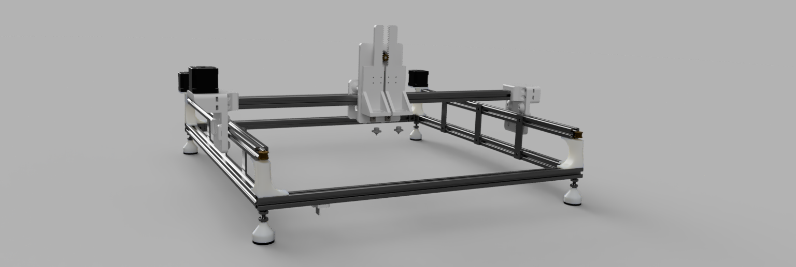

# Index PnP
The Index Pick and Place is an open source pick and place machine to aid in [Mid-Scale Manufacturing](http://stephenhawes.com/level-2-manufacturing/). 

This project is **under development**. It is not currently in a stable state. Development is active and ongoing, but this is not yet a finished design. If you'd like to build one to help find bugs and design issues, please do!

The Index is designed to be low-cost enough that someone could buy or build one to support making production runs at home or as a small business. It runs using OpenPnP.

The Index will eventually be able to do every component of PCBA manufacturing. It is currently capable of picking parts and placing them, but eventually the Index will support solder paste dispensing, automatic reflow, and even AOI. 

Along with the Index machine itself, the project also comes along with feeders designed to work with the Index. Although they were designed with the Index in mind, they can work with any OpenPnP pick and place with a 20mm x 20mm rail for mounting.

A full Bill of Materials for the project can be found [here](https://docs.google.com/spreadsheets/d/1N7jMZ2upi8-9_jjJnl2xC9bYtZuE1wX5Qzoa-qs21eY/edit#gid=476120456).

The Index's development process is being cataloged in a series of videos. A playlist of these can be found [here](https://www.youtube.com/playlist?list=PLIeJXmcg1baLBz3x0nCDqkYpKs2IWGHk4).

## System Overview
The Index is controlled with [OpenPnP](https://github.com/openpnp/openpnp). OpenPnP generates gcode based on PCB design files and sends it over to an Arduino MEGA and RAMPS shield setup running a modified version of Marlin. This handles controlling the motors, pump, limit switches, etc.

OpenPnP also connects to a secondary control board called the Piggyback. The Piggyback controls feeders. It receieves gcode from a Gcode Sub-Process in OpenPnP, then sends the appropriate command to the feeder.

The Piggyback communicates with the feeders using a tiny communication protocol written for this purpose called "RING". After the feeder receieves the RING command, it sends one back to the Piggyback to relay to OpenPnP. The feeders are also designed to send warning RING commands to the Piggyback in situations like tape runout or jam. 

The mechanical design of the system is largely based on the OpenBuilds ACRO 55. It is a V-Slot/roller motion control system with two motors controlling the Y gantry, one controlling the X, and one controlling the Z. All parts are optomized for FDM 3D printing.

## Building an Index
This is an unfinished design. Builds at this time should be thought of as helping the R&D process, and not for the end result of having a fully operational pick and place.

### Ordering PCBs
Many boards in the design are also used in a mechanical way, meaning some specifics of how the boards are ordered matters more than usual.

#### Default Configuration
- Board Thickness: 1.6mm
- Pad Plating: Any
- Silk/Mask: Any

#### Indexing Wheel Configuration
- Board Thickness: 1mm
- Pad Plating: ENIG
- Silk/Mask: White/Matte Black

### 3D Printing
During development of the Index, all parts were printed in PLA. A few parts in particular require quite a high strength if being printed. Of course, every printer runs a bit different, and these are just guidelines to illustrate the necessary strength difference between different parts.

#### Default Settings
- 3 shells
- 20% infill
- 5 Top/Bottom layers

#### Gantry Part Settings
- 4 shells
- 30% infill
- 5 Top/Bottom layers

